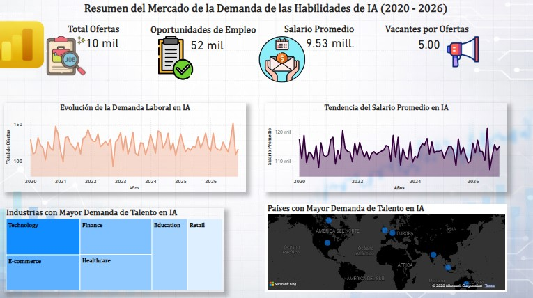
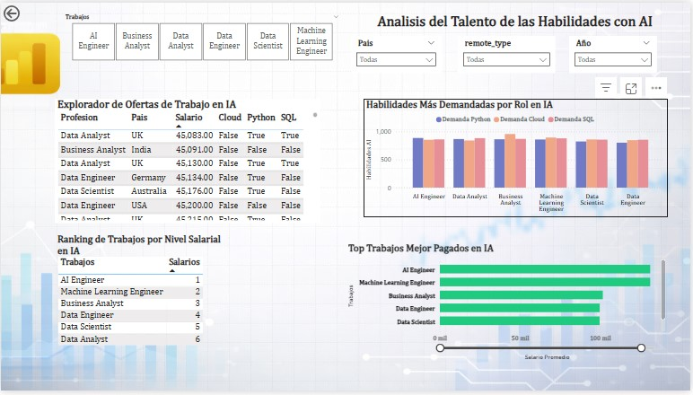

# 📊 AI Job Market BI Dashboard

## 🎯 Descripción del Proyecto
Este proyecto presenta un análisis completo del mercado laboral en Inteligencia Artificial (2020–2026), utilizando un enfoque de Business Intelligence con MySQL para la transformación de datos y Power BI para la visualización.
El objetivo es identificar patrones de demanda laboral, evolución salarial y habilidades clave requeridas en el mercado de IA.

## 🧠 Tecnologías Utilizadas
* MySQL (Data Modeling & Views)
* Power BI (Dashboard & DAX)
* SQL (ETL y agregaciones)
* DAX (KPIs y métricas avanzadas)

## 🗄️ Modelo de Datos
Se implementó un modelo tipo Star Schema:

* **Fact Table:** Fact_Postings
* **Dimensiones:** Dim_Location, Dim_Company, Dim_Job_Roles

## ⚙️ Vistas SQL Implementadas
* `vw_powerbi_master_audit` → Vista detallada
* `vw_kpi_summary` → KPIs globales
* `vw_trends_time` → Tendencias temporales
* `vw_skills_demand` → Demanda de habilidades
* `vw_salary_analysis` → Análisis salarial
* `vw_top_roles` → Ranking de roles

## 📊 Dashboard

### 🔹 Página 1: Resumen del Mercado

**KPIs principales:**
* Total Ofertas
* Oportunidades de Empleo
* Salario Promedio
* Vacantes por Oferta (Talent Demand Index)

---

### 🔹 Página 2: Análisis de Talento

* Habilidades más demandadas por rol
* Salario promedio por rol
* Ranking de roles mejor pagados
* Explorador detallado de ofertas

## 📈 KPIs Destacados
### 🔥 Talent Demand Index
Mide la presión de demanda de talento:
$$Vacantes por Oferta = \frac{Total\ Openings}{Total\ Jobs}$$
Este indicador permite identificar escasez de talento en el mercado.

## 💡 Insights Clave
* Existe una brecha significativa entre ofertas y vacantes → alta demanda de talento
* Python y SQL son habilidades base en la mayoría de roles
* Roles especializados como AI Engineer lideran en salario
* La demanda se concentra en industrias tecnológicas y financieras

## 🚀 Conclusión
Este proyecto demuestra la capacidad de:
* Diseñar modelos de datos para BI
* Transformar datos con SQL
* Construir dashboards interactivos
* Generar insights accionables

## 👨‍💻 Autor
Marccell Vilchez
